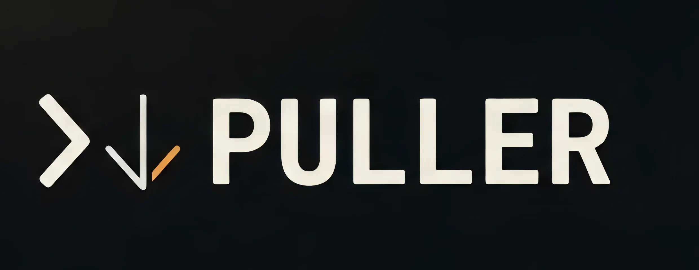

<div align="center">
  
</div>

# Puller — a yt-dlp powered YouTube downloader

A tiny local web app: paste a YouTube URL, pick video or audio, pick a
quality, download. Backend is FastAPI + yt-dlp; frontend is one plain
HTML file (no build step). Everything below is command-only so it
matches the actual repo contents.

## 0. Requirements

- **Python 3.9+**
- **ffmpeg** on your PATH — needed to merge video+audio streams and to
  transcode audio to a target bitrate
  - macOS: `brew install ffmpeg`
  - Windows: `winget install ffmpeg`
  - Linux: `sudo apt install ffmpeg` (Debian/Ubuntu) or your distro's equivalent

Check both are visible to your terminal:
```bash
python3 --version
ffmpeg -version
```
(Windows: use `python --version` instead of `python3`.)

---

## 1. Quick start

From inside the `ytdlp-downloader/` folder:

### Step 1 — Delete an existing virtual environment (only if one exists)

Removes the `.venv/` folder so you get a completely clean install.
Skip this the very first time you set the project up.

**macOS / Linux**
```bash
rm -rf .venv
```
**Windows (PowerShell)**
```powershell
Remove-Item -Recurse -Force .venv
```

### Step 2 — Create a new virtual environment

Creates an isolated Python environment in `.venv/` so this project's
dependencies never clash with anything else on your machine.

**macOS / Linux**
```bash
python3 -m venv .venv
```
**Windows (PowerShell)**
```powershell
python -m venv .venv
```

### Step 3 — Activate it and install requirements

Activating puts this project's isolated Python/pip first in your
shell's PATH for the current terminal session. `pip install -r
requirements.txt` then reads `requirements.txt` and installs FastAPI,
uvicorn, yt-dlp, and their dependencies into `.venv/`.

**macOS / Linux**
```bash
source .venv/bin/activate
pip install -r requirements.txt
```
**Windows (PowerShell)**
```powershell
.venv\Scripts\activate
pip install -r requirements.txt
```

You'll know activation worked because your prompt gets a `(.venv)`
prefix. Deactivate anytime with:
```bash
deactivate
```

### Step 4 — Start the server

With the virtual environment activated:

```bash
uvicorn main:app --host 127.0.0.1 --port 8000
```

- `main:app` — tells uvicorn to run the `app` object defined in `main.py`.
- For downloads, do not use `--reload` because it can interrupt in-flight
  worker threads before the file is ready.

Open **http://127.0.0.1:8000** — the backend serves the frontend
directly, so this one URL is the whole app.

To stop the server: `Ctrl+C` in the terminal it's running in.

---

## 2. Everyday use after the first setup

You only need Step 1–3 once (or after a `reset`). Every time after that:

**macOS / Linux**
```bash
source .venv/bin/activate
uvicorn main:app --host 127.0.0.1 --port 8000
```
**Windows**
```powershell
.venv\Scripts\activate
uvicorn main:app --host 127.0.0.1 --port 8000
```

---

## 3. Optional commands

**Make the app reachable from other devices on your home network:**
```bash
uvicorn main:app --host 0.0.0.0 --port 8000
```
Then visit `http://<your-computer's-LAN-IP>:8000` from another device
on the same Wi-Fi/network.

**Update yt-dlp** (run this whenever downloads start failing —
YouTube changes things often, and yt-dlp ships fixes frequently):
```bash
pip install -U yt-dlp
```
(Run this with the virtual environment activated.)

**Update all dependencies to what's pinned in requirements.txt:**
```bash
pip install -r requirements.txt --upgrade
```

---

## 4. Notes worth knowing

- **Single video URLs only.** Playlist URLs are rejected on purpose —
  paste an individual video's URL.
- **This runs locally, for personal use.** Downloading video is subject
  to YouTube's Terms of Service and copyright law in your country —
  that's on you to respect.
- **4K/HDR downloads are slow and large.** That's real transcoding/muxing
  work from ffmpeg, not a bug.
- **Audio downloads now include 320 kbps.** The UI exposes 48, 128, 256,
  and 320 kbps options.
- **Optional custom filenames are supported.** If you enter a name in the
  download form, the file will be saved using that name after sanitization.

---

## 5. Developer Info

- Name: Chirantan Mallick
- GitHub: [SpicychieF05](https://github.com/spicychief05)
- LinkedIn: [Chirantan Mallick](https://www.linkedin.com/in/c-mallick/)
- Tableau: [Chirantan Mallick vizzes](https://public.tableau.com/app/profile/chirantan.mallick/vizzes)

---

## 6. File Layout

```
ytdlp-downloader/
├── main.py            # FastAPI backend (yt-dlp glue)
├── requirements.txt    # Python dependencies
├── static/
│   └── index.html      # the entire frontend
└── README.md
```