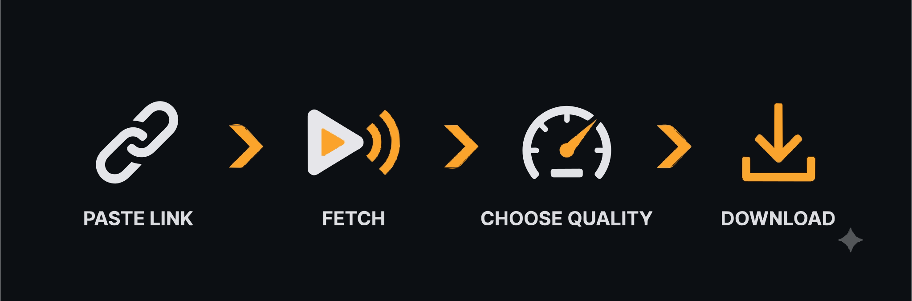

<div align="center">
  
</div>

# Puller — a yt-dlp powered YouTube downloader

A tiny local web app: paste a YouTube URL, pick video or audio, pick a quality, download. Backend is FastAPI + yt-dlp; frontend is one plain HTML file (no build step). Everything below is command-only so it matches the actual repo contents.



## Table of Contents
- [Requirements](#requirements)
- [Quick start (Windows)](#quick-start-windows)
- [Manual setup](#manual-setup)
- [Everyday use](#everyday-use)
- [Features](#features)
- [Optional commands](#optional-commands)
- [Deployment](#deployment)
- [Notes & limitations](#notes--limitations)
- [Developer Info](#developer-info)
- [File layout](#file-layout)

## Requirements

- **Python 3.9+**
- **ffmpeg** on your PATH — needed to merge video+audio streams and to transcode audio to a target bitrate.
  - macOS: `brew install ffmpeg`
  - Windows: `winget install ffmpeg`
  - Linux: `sudo apt install ffmpeg` (Debian/Ubuntu) or your distro's equivalent

Check both are visible to your terminal:
```bash
python3 --version
ffmpeg -version
```
*(Windows: use `python --version` instead of `python3`.)*

---

## Quick start (Windows)

If you are on Windows, you can use the included batch scripts to automatically configure and run the project.

1. **Setup:** Double-click `setup.bat` or run it from the command line. This creates an isolated virtual environment (`.venv`) and installs the dependencies automatically.
2. **Run:** Double-click `run.bat`. This activates the environment, starts the FastAPI backend, and automatically opens `http://127.0.0.1:8000` in your web browser.

---

## Manual setup

For macOS / Linux users (or if you prefer configuring Windows manually), follow these step-by-step commands inside the `ytdlp-downloader/` folder:

### Step 1 — Create a new virtual environment
Creates an isolated Python environment in `.venv/` so dependencies don't clash with your machine.

**macOS / Linux**
```bash
python3 -m venv .venv
```
**Windows (PowerShell)**
```powershell
python -m venv .venv
```

### Step 2 — Activate it and install requirements
**macOS / Linux**
```bash
source .venv/bin/activate
pip install -r requirements.txt
```
**Windows (PowerShell)**
```powershell
.venv\Scripts\activate
pip install -r requirements.txt
```

### Step 3 — Start the server
With the virtual environment activated:
```bash
uvicorn main:app --host 127.0.0.1 --port 8000
```
Open **http://127.0.0.1:8000** in your browser. To stop the server: `Ctrl+C` in the terminal.

---

## Everyday use

You only need to install dependencies once. Every time after that, just activate the environment and start the server:

**macOS / Linux**
```bash
source .venv/bin/activate
uvicorn main:app --host 127.0.0.1 --port 8000
```
*(Windows users can simply run `run.bat` again).*

---

## Features

- **Single video download:** Choose between Video (up to 4K, HDR options detected) or Audio only (48, 128, 256, 320 kbps). Custom filenames are fully supported.
- **Playlist support:** Paste a playlist URL to automatically probe and list all videos. You can download individual videos row-by-row, or click "Download all (.zip)" to batch download the entire playlist into a single `.zip` file.
- **Live progress indicators:** The UI polls the backend API to display real-time ETA and status text. An animated SVG spinner is shown during processing and seamlessly morphs into a checkmark upon completion.
- **Instant cancellation:** Active downloads can be interrupted at any time using the "Cancel" button. This works for single videos, individual playlist rows, and batch zip jobs. Cancelling automatically cleans up any partially downloaded temporary files.

---

## Optional commands

**Make the app reachable from other devices on your home network:**
```bash
uvicorn main:app --host 0.0.0.0 --port 8000
```
Then visit `http://<your-computer's-LAN-IP>:8000` from another device on the same Wi-Fi/network.

**Update yt-dlp** (run this whenever downloads start failing — YouTube changes things often):
```bash
pip install -U yt-dlp
```
*(Run this with the virtual environment activated.)*

**Update all dependencies to what's pinned in requirements.txt:**
```bash
pip install -r requirements.txt --upgrade
```

---

## Deployment

Puller is built with a FastAPI backend because `yt-dlp` and `ffmpeg` require a full Python environment and system binaries. 

**This app cannot be hosted on static providers like GitHub Pages or Vercel.** To deploy it publicly, you must use a Docker-based or VPS environment (such as Render, Fly.io, Railway, or a DigitalOcean droplet) that allows background threading, system-level ffmpeg installation, and local file storage for temporary processing.

---

## Notes & limitations

- **This runs locally, for personal use.** Downloading video is subject to YouTube's Terms of Service and copyright law in your country — that's on you to respect.
- **4K/HDR downloads are slow and large.** That's real transcoding/muxing work from ffmpeg, not a bug.
- **Custom filenames are sanitized.** If you enter a custom name, invalid path characters will automatically be stripped before saving.

---

## Developer Info

- Name: Chirantan Mallick
- GitHub: [SpicychieF05](https://github.com/spicychief05)
- LinkedIn: [Chirantan Mallick](https://www.linkedin.com/in/c-mallick/)
- Tableau: [Chirantan Mallick vizzes](https://public.tableau.com/app/profile/chirantan.mallick/vizzes)

---

## File layout

```
ytdlp-downloader/
├── main.py            # FastAPI backend (yt-dlp glue)
├── requirements.txt   # Python dependencies
├── run.bat            # Windows auto-start script
├── setup.bat          # Windows dependency installation script
├── static/
│   └── index.html     # the entire frontend
└── README.md
```